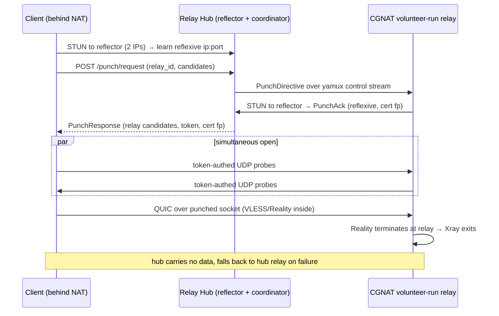
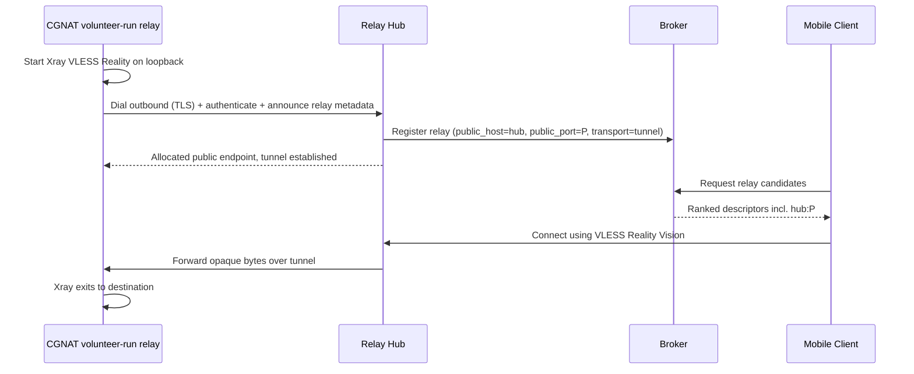
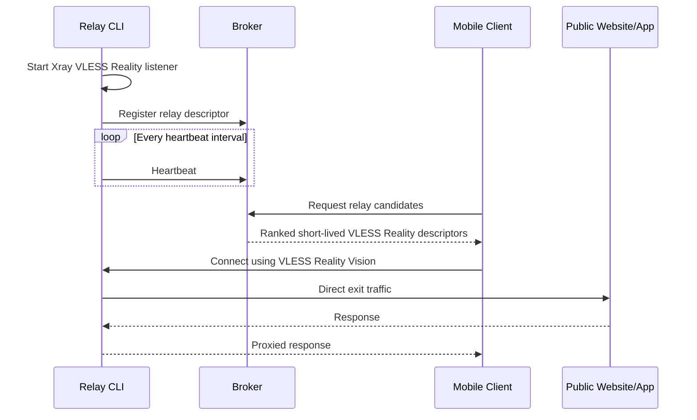

# Architecture

## Goals

OpenRung provides temporary relays in unrestricted regions so clients behind
internet censorship can reach blocked public websites and apps. Relays may be
Foundation-operated or run by community volunteers.

The current version optimizes for learning:

- Require each direct-mode relay to expose a publicly reachable TCP port.
- Use Xray-core for VLESS + Reality + Vision transport.
- Keep the broker out of the data path.
- Let the mobile client route all device traffic through a VPN tunnel.

## Components

### Broker

The broker is a control-plane service. It stores short-lived relay descriptors and returns candidates to clients.

The broker does not:

- Proxy user traffic.
- Store browsing destinations.
- Terminate VLESS sessions.
- Know client traffic contents.

The broker does:

- Accept relay registration.
- Track relay heartbeats.
- Expire stale relays.
- Return a small ranked candidate set to clients using recent relay load, success, latency, and speed-test signals.
- Optionally persist relay state in PostgreSQL so multiple broker instances can share one relay view behind a load balancer.
- Keep experimental relay/session/metric fields in JSONB columns until they are stable enough to promote into indexed columns.

### Relay CLI

The relay CLI (`cmd/relay`) runs on desktop systems. It starts an
Xray-core inbound listener and registers the relay with the broker. It defaults
to an IPv6 listener and auto-advertises the first global IPv6 address it can
find unless the operator supplies `-public-host`. With connection logging
enabled, `-listen-host dual` opens both IPv6 and IPv4 public listeners and
forwards both to one loopback Xray listener. The CLI also wraps Xray with a
local TCP observer by default so it can print client connect and disconnect
events without changing the broker descriptor.

The same executable serves both operator classes. Community-run relays register
as `node_class: "volunteer"`; relays presenting the Foundation credential
register as `node_class: "foundation"`. The broker attests this provenance in
the signed relay directory. It is not a quality score or a trust bypass.

Direct-mode relays, including the desktop relay engine, use only the canonical
`POST /api/v1/relays/register` and `/api/v1/relays/{id}/heartbeat` routes.
Broker errors are returned directly to the runtime, and broker redirects are
refused.

The CLI produces an Xray server config with:

- VLESS inbound.
- Reality transport.
- Vision flow: `xtls-rprx-vision`.
- Freedom outbound, meaning the relay is the direct exit.

Volunteer-run relays also support a **CGNAT reverse-tunnel mode** for hosts that
cannot expose a public port; see the Relay Hub section below. Foundation-token
relays are forced into direct mode so their privileged credential never enters
the hub path.

**Mode auto-detection.** For volunteer-run relays, the CLI picks direct vs
tunnel via `-mode`
(`auto` | `direct` | `tunnel`). In `auto` (the default whenever a `-hub` is
configured) it runs a startup **reachability probe**: it opens its listener and
asks the hub's HTTP API to dial it back at its observed public IP with a nonce
handshake. If the callback succeeds it registers **directly** (advertising the
observed IP), otherwise it falls back to **tunnel** mode — so operators no longer
have to know in advance whether a host is behind CGNAT. A probe that can't run
(hub HTTP API down) is treated as inconclusive and defaults to tunnel. `-mode
direct`/`tunnel` (and the legacy `-tunnel`) force a mode and skip the probe.

### Relay Hub (CGNAT volunteer-run relays)

Most volunteer-run relays expose a publicly reachable port. Relays behind
**CGNAT** (carrier-grade NAT) have no inbound port and cannot. The relay hub
(`cmd/relayhub`) is a separate, publicly reachable component that brings these
volunteer-run relays online:

- The relay runs Xray bound to **loopback** and dials the hub outbound over a
  single TLS connection (`-tunnel -hub <addr>`), authenticating with the same
  registration token.
- The hub allocates one public TCP port per relay, registers the relay with
  the broker (with `transport: "tunnel"` and `public_host`/`public_port` pointing
  at the hub), and multiplexes inbound client connections to the relay over the
  tunnel using yamux. The hub uses only the canonical
  `POST /api/v1/relays/register` and `/api/v1/relays/{id}/heartbeat` routes;
  broker errors are returned directly.
  Clients connect to `hub:port` exactly as they would any direct relay — no client
  changes.
- Descriptor liveness is tied to the tunnel: the hub heartbeats while the tunnel
  is healthy and stops when it drops, so the relay expires via the broker's normal
  lease TTL. Stable-identity registrations also receive a per-registration lease
  token. The hub presents it on each heartbeat, so a stale session or replay that
  replaces the descriptor cannot be kept alive by the current tunnel; its next
  heartbeat fails and drives a genuine re-registration.

The hub is a **data-plane** component, deliberately distinct from the control-plane
broker — the broker stays out of the data path (see Goals). The hub only copies
**opaque bytes**; it never holds the Reality private key and cannot decrypt the
end-to-end traffic, so the relay-as-untrusted-network trust boundary is
preserved across the hub too.

Because all CGNAT relay traffic transits the hub, the relay path is opt-in
(public-IP/IPv6 volunteer-run relays stay direct and never touch the hub), and
hubs should run where bandwidth is cheap rather than on metered cloud egress (see
`deploy/relayhub/README.md`). To keep the hub out of the hot path when possible,
CGNAT relays also support **direct NAT hole punching** (below); the hub tunnel
remains as the always-available fallback. Per-relay/per-hub bandwidth caps are
still future work.

### Direct NAT Hole Punching (client ↔ CGNAT volunteer-run relay)

When both the client and a CGNAT volunteer-run relay are behind NAT, they can
still reach each other **directly** by punching a UDP hole, taking the hub out
of the data path. The hub coordinates but never carries the bytes.

- **Rendezvous + reflector = the hub.** The hub already holds the only live,
  authenticated control connection to each CGNAT relay (the yamux tunnel), so
  it is the one component that can push a punch request to the relay. It also
  runs a small UDP **reflector** (STUN-like) so each peer learns its
  server-reflexive `ip:port`. The broker is untouched; it only gains an additive
  `punch_capable` descriptor flag so clients know to try.
- **Discovery + NAT classification.** Each peer probes the reflector from the same
  UDP socket it will punch and carry QUIC on. Binding the reflector on **two
  distinct public IPs** lets the hub classify the peer's NAT mapping: a stable
  reflexive port across both IPs is endpoint-independent (punchable); a differing
  port is symmetric (skipped). With a single reflector IP the class degrades to
  "unknown" and the client attempts anyway, then falls back.
- **Signalling.** The client asks the hub over a dedicated HTTP endpoint
  (`POST /api/v1/punch/request`, on the hub's own listener, not the broker and not
  Cloudflare-fronted, so it is separately rate-limited). The hub relays a
  `PunchDirective` to the relay over the yamux control connection, using a
  one-byte stream-type discriminator that is only emitted when both ends negotiate
  it in the HELLO/HELLO_ACK handshake — so the tunnel control-protocol version is
  unchanged and older relay runtimes/hubs keep working.
- **Transport.** After a token-authenticated simultaneous-open UDP punch, the two
  peers run **QUIC** (quic-go) over the punched socket: it gives the reliable,
  ordered, multiplexed byte stream that VLESS/Reality-over-TCP needs. The client
  exposes a loopback TCP bridge that sing-box dials in place of the relay; the
  relay bridges each QUIC stream to its loopback Xray. Reality still terminates
  only at client and relay — the QUIC layer carries opaque bytes,
  so the E2E trust boundary is preserved (QUIC's TLS is a transport/pinning layer,
  not a new decryption point).
- **Authentication.** The hub issues a per-session HMAC token (delivered over the
  authenticated HTTP and control channels); the UDP probes and the first QUIC
  stream carry it, verified in constant time. The QUIC certificate is pinned by a
  fingerprint the relay reports through the hub.
- **Fallback is invisible and fail-closed.** If the relay is not punch-capable,
  both NATs are symmetric, the relay id is stale, or any step times out within the
  budget, the client silently uses today's path (sing-box dials the hub's public
  TCP port). QUIC's bidirectional handshake means a half-open hole can never
  false-succeed.

Honest scope: this reliably serves endpoint-independent-mapping (home-broadband /
full-cone) volunteer-run relays; **double-symmetric CGNAT is deliberately not
solved** and stays on the hub relay. The shared protocol core (wire format,
discovery, punch mechanics, reflector, policies) lives in the nested
`punchcore/` Go module
(`github.com/openrung/openrung/punchcore`) — the single source of truth with no
hand-mirrored copies. The servers and the desktop client consume it in-repo via
`internal/punch` (the quic-go session/transport/bridge layer); the Android app's
gomobile binding (`android/punchbridge` in `openrung-mobile-app`) consumes the
punchcore module at a pinned, tagged version. iOS remains a follow-up: it embeds
stock sing-box without an app-layer punch client, so it ignores `punch_capable`
and uses the hub relay with no regression.

#### punchcore pin/upgrade procedure (wire changes)

1. Edit `punchcore/` in an openrung PR — the hub, relay runtimes, and desktop
   clients consume it via the in-repo `replace`, so servers and desktop stay
   atomically consistent.
2. Bump `punchcore/VERSION` in the same PR — the `go-checks` workflow fails
   any PR that changes `punchcore/` without a fresh, untagged version.
3. Merge. The `punchcore-tag.yml` workflow tags `punchcore/v$(VERSION)` on the
   merge commit automatically (the nested-module tag makes it fetchable
   through the Go proxy); no manual tagging.
4. Dependabot in the mobile repo (scoped to punchcore) opens the
   `android/punchbridge/go.mod` (+`go.sum`) bump PR when it sees the new tag,
   which automatically busts the AAR CI caches (their hash keys include
   go.mod/go.sum). Manual fallback: `go get` the new version directly.
5. Rebuild the AAR via `android/build-libbox-release.sh` and ship.

Local cross-repo development uses
`PUNCHCORE_SRC=/path/to/openrung/punchcore android/build-libbox-release.sh`
and/or an uncommitted `go.work` — never in releases (GPL §6 pins the module
version).

### Relay-local WSS fallback (desktop client ↔ Foundation relay)

Eligible direct-mode Foundation relays can expose a CDN-fronted WebSocket
fallback when a client network blocks the relay's raw IP. This is not the Relay
Hub and does not introduce a gateway fleet: every advertised front has that
same relay as its CDN origin, and the relay-local sidecar can dial only its
fixed loopback Reality listener. Direct Reality remains the desktop client's
first choice, and Reality still authenticates and encrypts the complete inner
connection end to end. See [`wss-fallback.md`](wss-fallback.md) for the full
protocol, failure-classification, and rollout contract.

The nested `wsscore/` Go module
(`github.com/openrung/openrung/wsscore`) is the single reusable implementation
of the WSS data-plane mechanics. Both the desktop client and the relay-local
sidecar consume it. It owns the protocol constants, strict advertised-front URL
validation, binary-only WebSocket byte-stream adapter, shared bounded yamux
configuration, opaque bidirectional copying, lifecycle limits, and the optional
socket-control hook a future Android integration can connect to
`VpnService.protect`.

The module deliberately does not own system policy or authority. Broker ticket
issuance, relay-local ticket verification and replay persistence, CDN origin
authentication, per-source admission policy, relay capability signing,
CloudFront/deployment configuration, desktop direct-first and health/telemetry
orchestration, and every platform UI remain in this repository's surrounding
packages and applications. A ticket is only an opaque bearer value to the
shared transport; `wsscore` never selects a relay or destination.

#### wsscore pin/upgrade procedure

1. Edit `wsscore/` in an openrung PR. The root and desktop Go modules consume
   the in-tree source through local `replace` directives, keeping the desktop
   client and relay sidecar on one implementation in this repository.
2. Bump `wsscore/VERSION` in the same PR. Except for a `README.md`-only edit,
   the Go checks reject a module change without a fresh, previously untagged
   semantic version.
3. Merge. The tag workflow creates `wsscore/v$(VERSION)` on the merge commit,
   making that nested-module version fetchable without copying its code into a
   consumer repository. Golden and live interoperability tests guard its public
   protocol and transport behavior.
4. External clients explicitly update their pinned module version, integrate
   their platform socket-routing and fallback policy, run their own tests, and
   publish their own application release. Updating or tagging `wsscore` does
   not release a mobile app.

Local cross-repository development may use an uncommitted `go.work` or local
module replacement. Released consumers pin a `wsscore/vX.Y.Z` tag.

### Mobile Client

The mobile client is an iOS/Android app using VPN mode. It asks the broker for
relay candidates, configures a compatible VLESS Reality client, and routes
device traffic through the selected relay.

Android and iOS are maintained outside this repository, with their own native
VPN integration, tests, version pins, and release processes:

- Android uses `VpnService` plus the embedded tunnel engine.
- iOS uses a `NetworkExtension` packet tunnel provider.

The reusable `wsscore` module makes a future transport integration possible but
does not restore or ship WSS fallback on either platform. Android must still
wire socket protection and the ticket/direct-first policy in its repository;
iOS must perform its corresponding platform integration. Each mobile release
must advertise support only after that repository independently implements and
tests the complete contract.

### Future Dedicated Exit Mode

In a later phase, volunteer operators should be able to choose one of two modes:

- Direct exit mode: the volunteer-run relay connects directly to destination
  websites.
- Entry relay mode: the volunteer-run relay accepts client traffic and routes
  it to a dedicated exit server.

Entry relay mode protects volunteers from being the destination-visible exit IP. The broker descriptor should therefore keep `exit_mode` as an explicit field from the start.

## Current Data Flow

## Trust Boundaries

Relays are not inherently trusted. The client should treat each relay operator
as a network provider. A broker-attested `node_class` identifies operator
provenance; it does not relax any transport, signature, or destination-security
requirement:

- Use HTTPS/TLS to destination sites whenever possible.
- Avoid sending broker credentials to relay operators.
- Rotate relay credentials frequently.
- Prefer short-lived relay descriptors.

The broker should treat relay registrations as untrusted input:

- Require authentication for relay operators outside local development.
- Validate ports, hostnames, protocol fields, and advertised capabilities.
- Expire inactive relays aggressively.
- Relay identity continuity (spec `openrung-relay-identity-v1`, see the API
  doc) is proven, never asserted: the relay ID is derived from an Ed25519 key
  the registrant demonstrates possession of, so identity-bound history (labels,
  ranking, dashboard attribution) cannot be claimed from the public relay list.
  The identity carries no authority beyond ID continuity — classes and
  endpoint protections are enforced exactly as for anonymous registrations.

The current scaffold advertises one generated VLESS client ID per relay process.
That is acceptable for early private testing, but public versions should issue
short-lived per-client credentials and push them into Xray dynamically.

## Open Design Decisions

- Public reachability probing: the broker should eventually verify the
  advertised endpoint from outside the relay operator's network, especially for
  IPv6 hosts where residential firewalls may block inbound connections even
  without CGNAT.
- Relay selection: global score is implemented; later add country/ASN-specific scoring and reputation.
- Abuse controls: add per-relay limits, destination policy, reporting, and blocklists before public rollout.
- Mobile engine: choose whether to embed a maintained Xray-compatible engine or call into a separate core.
