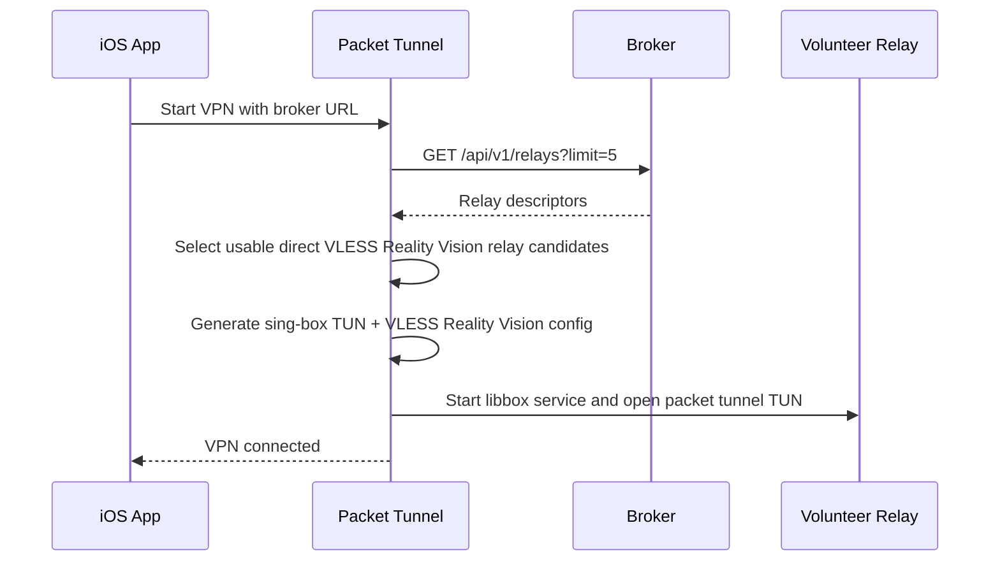

# iOS Client Plan

The iPhone client is a VPN-mode app. The broker stays in the control plane, and all data traffic exits through the selected volunteer relay.

## Initial targets

1. SwiftUI app for VPN permission, broker URL entry, status, connect, and disconnect.
2. Packet Tunnel extension using `NEPacketTunnelProvider`.
3. Shared Swift package for broker API models and relay selection.
4. Embedded VLESS Reality Vision engine adapter.
5. Full-device routing with DNS through the tunnel and fail-closed behavior.

The SwiftUI app is the initial control surface. The native packet tunnel should stay independent enough to be controlled by a future React Native shell through a small native module.

## Implemented scaffold

The initial scaffold lives under `ios/`:

- `ios/OpenRungKit`: broker models, relay selection, engine config.
- `ios/OpenRungClient/App`: host app.
- `ios/OpenRungClient/PacketTunnel`: packet tunnel provider and Libbox-backed proxy engine adapter.
- `ios/ThirdParty/README.md`: rebuild steps for the local ignored `Libbox.xcframework`.
- `ios/project.yml`: XcodeGen spec.

## Packet tunnel lifecycle



## Engine adapter contract

The packet tunnel depends on `PacketTunnelProxyEngine`:

```swift
protocol PacketTunnelProxyEngine: AnyObject {
    func start(relay: RelayDescriptor, tunnelProvider: NEPacketTunnelProvider) async throws
    func stop()
}
```

This boundary should hide whether the final core is Xray, sing-box, or another compatible engine.

The current implementation uses sing-box/libbox. It builds the config in `OpenRungKit` and starts the generated `Libbox.xcframework` from the Packet Tunnel extension.

## Fail-closed behavior

The tunnel should not complete startup unless:

- a usable relay is available,
- full-tunnel network settings are installed,
- the proxy engine starts successfully,
- the selected volunteer can be reached.

If any of those fail, the VPN startup returns an error instead of silently falling back to direct device networking.

The packet tunnel tries usable broker candidates in order. If every relay fails, startup fails closed with the last connection error.

## Remaining validation item

The embedded engine is linked and compiles. The remaining proof is runtime validation on a signed physical iPhone with the Network Extension packet-tunnel entitlement, using a live broker and volunteer relay.
